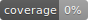

```
      _                 _         _____       _     _           
     (_)               | |       / ____|     (_)   | |          
  ___ _ _ __ ___  _ __ | | ___  | (___  _ __  _  __| | ___ _ __ 
 / __| | '_ ` _ \| '_ \| |/ _ \  \___ \| '_ \| |/ _` |/ _ \ '__|
 \__ \ | | | | | | |_) | |  __/  ____) | |_) | | (_| |  __/ |   
 |___/_|_| |_| |_| .__/|_|\___| |_____/| .__/|_|\__,_|\___|_|   
                 | |                   | |                      
                 |_|                   |_|                      

```      
 
# simple Spider 




[中文](./Readme-zh.md):blush:

## Overview

A simple web crawling framework.

## Getting Started

`git clone` https://github.com/duiliuliu

`python main baidu.com`

You should revise main.py to suit your needs 

`Ctrl-C to stop`

## Referenced Libraries

* Using [requests](https://facebook.github.io/react/) as htmlDownloader
* Using [lxml](http://redux.js.org/) as default htmlParser
* Using [csv](http://redux.js.org/) provide feature that export file as csv type
* Using [xlwt](http://redux.js.org/) provide feature that export file as excel type
* Using [xlsxwriter](http://redux.js.org/) provide feature that export file as xexcel type

## Project structure

```
- crawler/
    - __init__.py
    - test/
      - htmlDownloder_test
      - htmlParser_test
      - requestManager_test
      - writter_test
      - logger_test
      - spider_test
      
    - htmlDownloder
    - htmlParser
    - requestManager
    - writter
    - logger
    - spider

- main.py
```