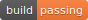

# simple Spider 




```
      _                 _         _____       _     _           
     (_)               | |       / ____|     (_)   | |          
  ___ _ _ __ ___  _ __ | | ___  | (___  _ __  _  __| | ___ _ __ 
 / __| | '_ ` _ \| '_ \| |/ _ \  \___ \| '_ \| |/ _` |/ _ \ '__|
 \__ \ | | | | | | |_) | |  __/  ____) | |_) | | (_| |  __/ |   
 |___/_|_| |_| |_| .__/|_|\___| |_____/| .__/|_|\__,_|\___|_|   
                 | |                   | |                      
                 |_|                   |_|                      

```      
 

[中文](./Readme-zh.md)

## Overview

A simple web crawling framework.[Document](https://duiliuliu.github.io/simple-spiders/)

## Getting Started

`git clone` https://github.com/duiliuliu/simple-spiders

`python main baidu.com`

You should revise main.py to suit your needs 

`Ctrl-C to stop`

## Referenced Libraries

* Using [requests](https://github.com/requests/requests) as htmlDownloader
* Using [lxml](https://github.com/lxml/lxml) as default htmlParser
* Using [csv](http://www.python-csv.org) provide feature that export file as csv type
* Using [xlwt](http://www.python-excel.org/) provide feature that export file as excel type
* Using [xlsxwriter](https://xlsxwriter.readthedocs.io) provide feature that export file as xexcel type

## Usage

## Project structure

```
- crawler/
    - __init__.py
    - test/
      - htmlDownloder_test
      - htmlParser_test
      - requestManager_test
      - writter_test
      - logger_test
      - spider_test
      
    - htmlDownloder
    - htmlParser
    - requestManager
    - writter
    - logger
    - spider

- main.py
```

## License

本项目采用 [](https://github.com/duiliuliu/simple-spiders) 协议开源发布，请您在修改后维持开源发布，并为原作者额外署名，谢谢您的尊重。

若您需要将本项目应用于商业目的，请单独联系本人( [@pengr](https://github.com/duiliuliu) )，获取商业授权。
